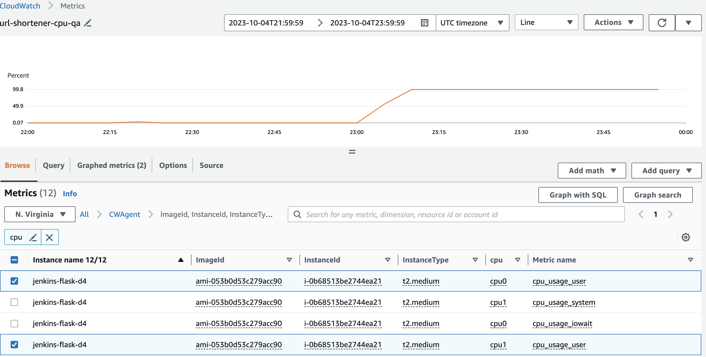

# Vertically scale T2 micro instance to a T2 medium instance

**This repository walks through a scenario where infrastructure engineers would need to vertically scale compute and memory resources to handle increased http traffic to NGINX proxy forwarding to a gunicorn server running a Flask application. In this case the Flask application is a URL-Shortener**

## Story:
The URL Shortener has become very popular recently. The URL Shortener is growing in demand and you must ensure at least 14,000 users can access the application at any moment.

## QA Scenario:
The QA engineer will send 14,000 requests to the server. After the QA engineer tests your application, they will update you about the results.

### QA Engineer's Results:
The QA engineer sent 14,000 requests to the server. The QA engineer reported that the server did not respond to all requests. The server only responded to 9 requests and 99% of cpu resources were used.



## Resolution:
The infrastructure engineer will need to vertically scale the compute and memory resources to handle the increased traffic. The infrastructure engineer will need to vertically scale the T2 medium instance to a T2 xl instance.

## Create an T2.xl instance
1. Navigate to the EC2 dashboard
2. Select Launch Instance
3. Select Ubuntu Server 18.04 LTS (HVM), SSD Volume Type
4. Select T2 xl instance
5. Make sure the instance is in the same VPC as the T2 medium instance
6. Make sure the instance is in the same az as the T2 medium instance

### Steps to manually vertically scale:
1. Stop the T2 medium instance
2. Detach the volume from the T2 medium instance
   - In the EC2 dashboard, under the Elastic Block Store section, select Volumes
   - Select the volume attached to the T2 medium instance
   - Select Actions -> Detach Volume
   - Record the volume ID and the volume's name e.g. /dev/sda1
   - Repeat the above steps for the T2 xl instance
3. Attach the volume to the T2 xl instance
   - In the EC2 dashboard, under the Elastic Block Store section, select Volumes
   - Select the volume ID recorded in step 2
   - Select Actions -> Attach Volume
   - Select the T2 xl instance
   - Ensure that the volume name is the same as the T2 medium instance e.g. /dev/sda1
4. Start the T2 xl instance
5. Add the IAM role for the Cloudwatch agent
6. SSH into the T2 xl instance
7. You'll need to start the Cloudwatch agent on the T2 xl instance
``` bash
sudo /opt/aws/amazon-cloudwatch-agent/bin/amazon-cloudwatch-agent-ctl -a fetch-config -m ec2 -c file:/opt/aws/amazon-cloudwatch-agent/bin/config.json -s
```

Rebuild the Jenkins job

1. Navigate to the Jenkins dashboard
   - Select the url-shortener job
   - Rebuild the job
